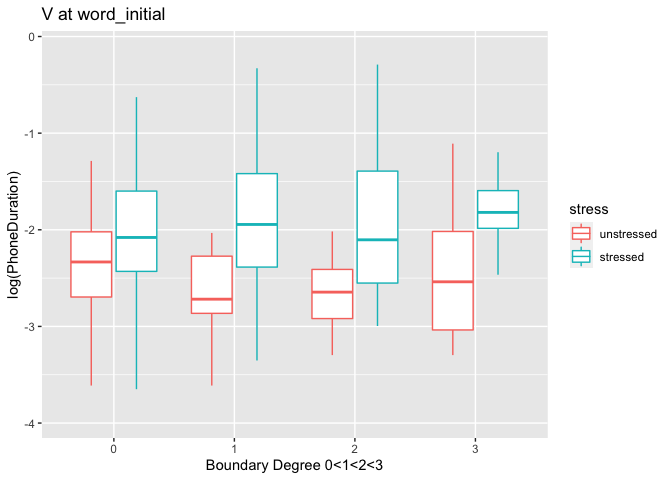
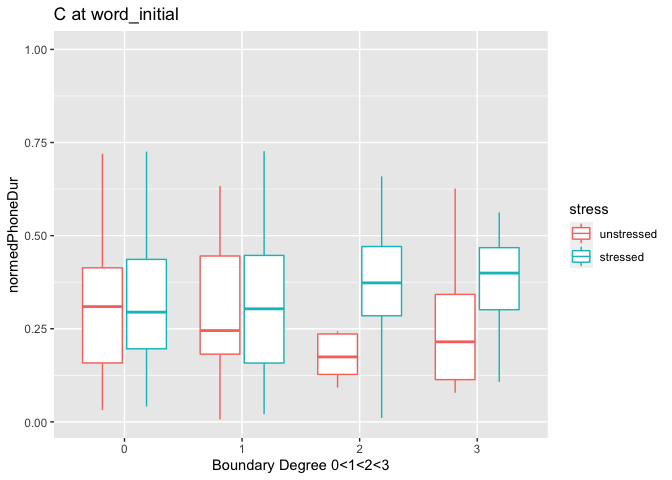
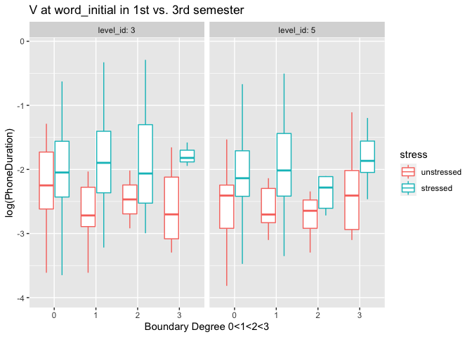
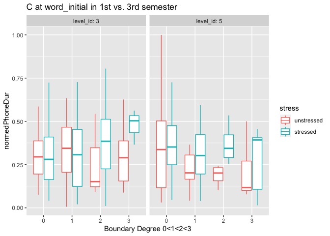

Final report
================  

### Miroo Lee (mil136@pitt.edu) ###
12/14/2021

### Summary ###  
This project aims to explore a way to examine the rhythmic properties of the L2 English learners' spontaneous speech and how such rhythmic properties change as the speaker gains more proficiency. To address this question, this project adopted a well-known concept from the laboratory-based phonology; phonetic encoding of prosodic domains. I examined the duration of consonant and vowels in two-minute monologues by Korean learners of English in two different proficiency levels.

### Background/Motivation ###  
Within the intonational framework, the speaker is known to modulate the phonetic segments at  prosodically critical locations, such as prosodic domain junctures (leading to boundary effects) and lexical stress (leading to stress effects) both temporarily and spatially (Byrd & Saltzman, 2003; Beckman & Pierrehumbert, 1986; Pierrehumbert, 1980). This is known as phonetic encoding of prosodic domains, and such fine-tuned modifications in acoustic signal are known to help listeners to succesfully parse the continuous stream of sounds (Cho, 2016). This phonetic encoding of prosodic domains, however, has been mainly discussed in the context of expert users' speech. I am interested in how we can understand L2 speakers rhythmic development in relation to how they may mark prosodic domains.  

### Theoretical background ###   
The prosodic structure is an abstract structure that serves a frame for articulation (Beckman, keating ). In the intonational framework developed by Backman and Pierrehumbert, prosodic structure consists of different levels of phonological representations such as mora, syllable, feet, prosodic word, intermediate phrase (ip) and intonation phrase (IP) (Cho, 2016; Féry, 2017). The different hierarchy of prosodic domains can be defined by the combination of pitch movement sometimes with a presence/absence of pause in an utterance (Beckman & Pierrehumbert, 1986; Pierrehumbert, 1980). One of the phonetic effects of prosodic domains in speech is the lengthening of phonetic segments around the boundaries between prosodic domains. Previous studies showed that phonetic segments located at the higher prosodic domains get greater lengthening effects than the phonetic segments located at the lower prosodic domains. It was also found that the length of pause duration is relatively proportional to the hierarchy of prosodic domains - with longer pause after higher prosodic domain and shorter pause after lower prosodic domain. This relationship between pause durations and prosodic domain hierarchy offers an opportunity to examine prosody in non-expert users of language who may not use the pitch movement in the same way that expert users do. Therefore, I decided to use the pause duration as a proxy measure for the hierarchy of prosodic domains. It is assumed that the longer the pause is, the greater the neighboring segments will be affected. The hypothesis is that the L2 learners will display greater control of the segment duration modification as they gain more proficiency by showing greater prosodic boundary effect.  

### Dataset ###    
I used a subset of PELIC speech corpus, focusing on two-minute monologues by Korean learners of English speakers in the first vs. third semester. The monologues were recorded by Korean students during the language class as a part of an activity. The students could record the speech multiple times if they wanted, but they were not allowed to use any scripts. I annotated 19 monologues by five students. I marked each word for its initial and final syllable, then marked each syllable for its structure (ex: CV, CVV) and the presence of lexical stress. I wanted to look at how consonant and vowel portions of a syllable are differently (or similarly) affected by prosodic domains. After annotating the speech files, I used a Praat script to compile the information from all the textgrids into a single csv file. I then added multiple variables that will help my analysis.  

### Analysis ###    
I originally planned to look at voiceless VOT and vowel durations. But the number of data points of VOT was too small, so I expanded the scope to include both voiceless VOT and voiceless fricatives. I assigned levels of prosodic domains depending on the duration of the preceding pauses (from 0 to 3). I focused on boundary lengthening effect that happens to the following segments, which is knowns as a Domain-Initial Strengthening (DIS) effect. There were three predictors in total; DIS level, lexical stress, and proficiency level. I used normalized vowel duration and a ratio of consonant over syllable duration as dependent variables. I included participant and word as random effects for vowels. While I did not specify the vowel type in my annotation, I did specify the different types of consonant. For consonants, I additionally included phone label as a random effect, which yielded better fitting models. In order to understand the data, I first built models without interactions. Then I built additional models with interactions. The data processing steps are as the following:  
1. Search for the right wav files for the analysis [`search_wav.Rmd`](search_wav.Rmd)  
2. Annotate files in praat textgrid.  
3. Export annotated information on multiple textgrids to a single csv file [`export_from_three_tiers.praat`](export_from_three_tiers.praat).  
4. Add variables and prepare word-initial and word-final datasets. [`data_analysis.Rmd`](data_analysis.Rmd)  
5. Build mixed-effects models without interaction term.  
  
  
***The above plot shows DIS decreases V while stress increases V.***  
  
   
    

  
***C and D are measured differently so I have to be careful when comparing them. But one thing I am noticing in the plot above is that in C, the stress effect seems to be less than in V. While it isn't clear on the plot,the statistical results show DIS increases C% while stress decreases C%.***   

  
6. Build mixed-effects models with interactions.  
  
***With the three-way interactions, the model only showed significant lengthening effect of stress on V. There was no change as a function of proficiency level*** 

  
***With the three-way interactions, the model showed significant shortening effect of stress on C%. Stress further interacted with DIS in that when the syllable was both stressed and had high level of DIS, C% increased. Interestingly, the learners showed increase in C% when the syllable follows a pause greater than 2s.***  

### Interpretation ###    
  
The model with three-way interactions only showed a significant lengthening effect by stress on V. In other words, Korean learners of English speakers consistently modulated their vowels only when there is a lexical stress, but maintained the similar vowel duration regardless of DIS. There was no effect of proficiency - suggesting that rhythmic patterns of vowels remain somewhat robust throughout their three semestsers of language classes for English learners.  
  
  
**Note: I thought maybe the entire speech rate was sped up in the third semester, which may have masked the changes in vowel duration, so I conducted an analysis on syllable durations. I did not find significant difference in syllable durations between first and the third semester, which suggests that the speech rate did not differ significantly.**

  
On the other hand, the statistical model for C% showed a significant decrease in C% when the syllable is stressed. The fact that C% was reduced shows that listeners do not simply mark lexical stress by lengthening the entire syllable, but actually target the vowel, enhancing the vocalic feature of the syllable overall. However, when listeners produce stressed syllables at the beginning of high prosodic domain after a long pause(>1s), they tend to lengthen the entire syllable rather than just lengthening the vocalic portion of the syllable. In other words, the relative proportion of C and V in syllables are maintained when the syllable is both lexically stressed and at the beginning of a high prosodic domain. Interestingly, speakers showed a significant decrease in higher prosodic domain (>2s) in their third semester. This can be seen in the right panel of the plot, where the C% duration seems to go down as DIS boundary level goes up in the third semester compared to the first semester. In other words, L2 English learners seem to utilize segment differences (consonant versus vowels) when encoding prosodic domains, selectively targeting and shortening the consonantal proportion of the syllable.  

### Conclusions ###  
I was surprised to find that an increase in proficiency is related to the shortening of consonantal features in higher DIS. This was particularly interesting to me because my underdstanding of the expert language users' data is that usually expert language speakers increase consonantal portion in higher DIS. DIS was found not just in English but also in many other languages including Korean, and seems to be universal.  
However, given that Korean does not have lexical stress, Korean may be more restricted when it comes to modulating the segment duration compared to other languages like English which has lexical stress and uses durational changes to mark the stress. So the degree of lengthening of consonantal feature may not be as dramatic in Korean than in English. But then, there is still a question of why do they shorten C% at all in higher DIS.  
We can postulate that Korean learners may try to mark DIS by relying on relying on vocalic feature of the syllable. That is, instead of marking the DIS by enhancing consonantal feature as the English native speakers, Korean learners may mark the DIS by enhancing the vocalic feature. But instead of directly modulating the vowel duration, Korean learners achieve the similar results by cutting the C% short. It is possible that this reducing of C% is attributed to the L1 Korean prosody which has relatively rigid frame for segment durations.  
Another possibility is that this is rather a universal developmental pattern of prosody in that learners learn to differently mark stress vs. boundary effect by actively increasing the vowel with lexical stress and not doing the same so for higher DIS. 
The future study can test these two possibilities by examining learners whose L1 has durationally marked lexical stress, such as Arabic. If Arabic learners showed similar reducing pattern of C% as Korean learners, the reduction of C% might be more general developmental pattern. If Arabic learners didn't show the same reducing %C pattern, the reason for current data could be the L1 stress system. 
